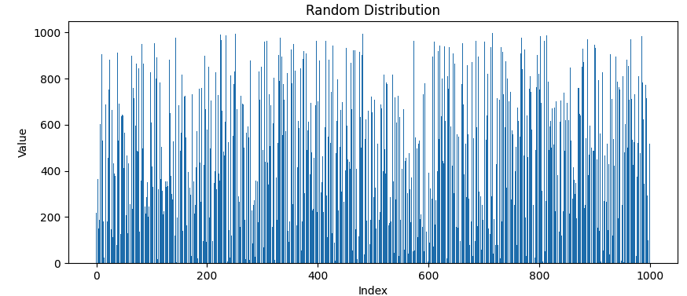
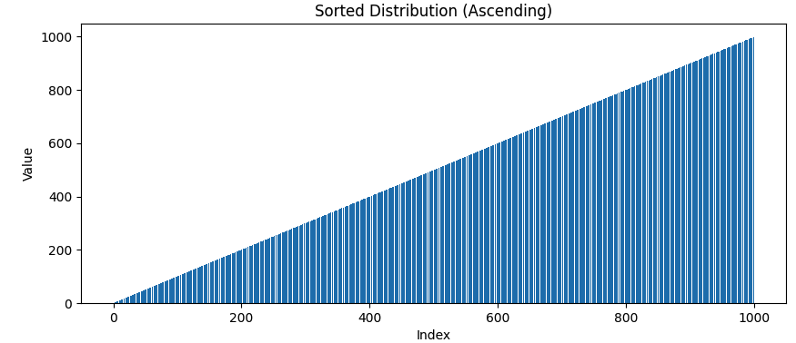
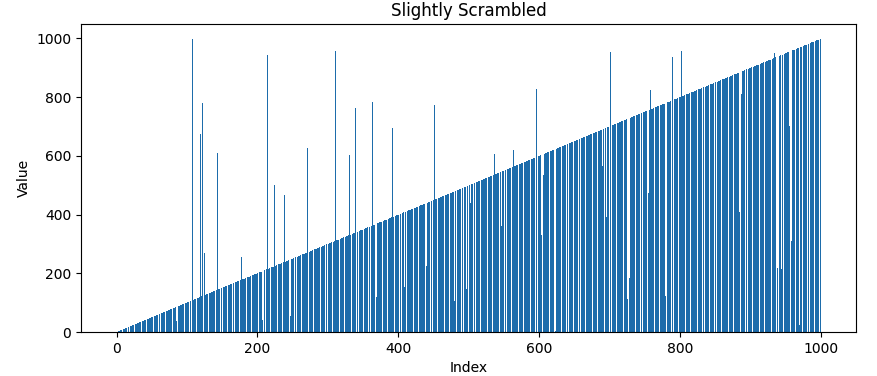
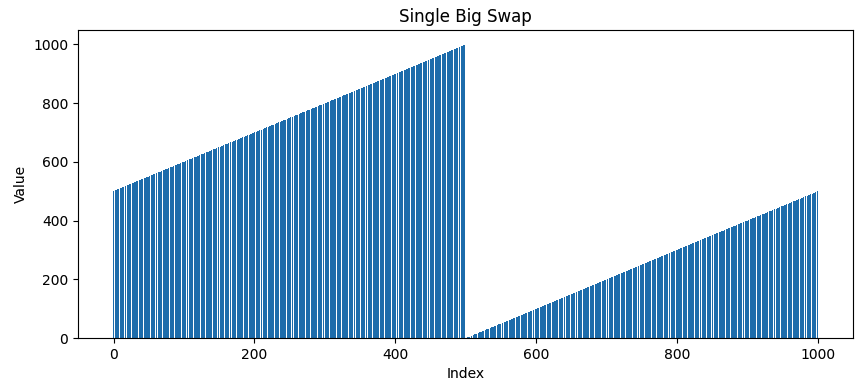
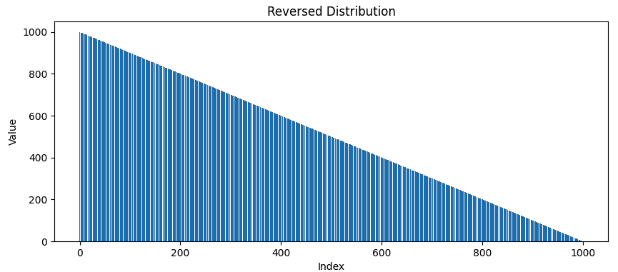
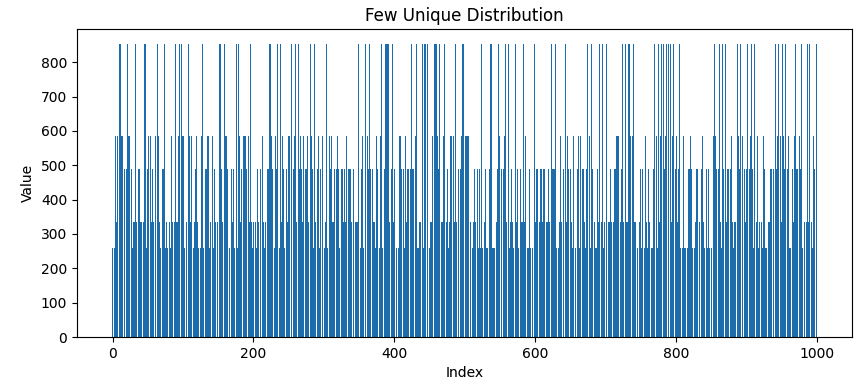

# sorting-alg-benchmark
A comprehensive C++ project benchmarking the performance of various sorting algorithms, including TimSort, IntroSort, MergeSort, QuickSort, and HeapSort, across different data distributions to understand their efficiency and behavior in diverse scenarios

## How to Run
0. Make sure you have installed `CMake`, `make`, and a C++ compiler (e.g., g++)
1. Clone the repository and navigate to the project directory
    ```bash
    git clone https://github.com/NTUCSRC/sorting-alg-benchmark.git
    cd sorting-alg-benchmark
    ```
2. Generate testing data
    ```
    cd data
    python3 generate.py
    ```
3. Run the following commands in the terminal:
    ```bash
    cd sorting-alg-benchmark
    mkdir build
    cd build
    cmake ..
    make
    ./sorting-alg-benchmark <distribution> <number of elements>
    ```
## Performance Analysis

### Random Distribution
Description: Generates a list of random integers within a specified range. This distribution is useful for testing sorting algorithms under average, everyday conditions where the input order is completely unsorted and unpredictable.



#### Perfromance @ 100 Elements
```
----------------------------------------------------------------------
Benchmark                            Time             CPU   Iterations
----------------------------------------------------------------------
InsertionSort/iterations:10      19783 ns        19800 ns           10
HeapSort/iterations:10           25596 ns        25500 ns           10
IntroSort/iterations:10           8971 ns         8900 ns           10
MergeSort/iterations:10          72546 ns        72500 ns           10
QuickSort/iterations:10           8212 ns         8100 ns           10
```
#### Performance @ 1000 Elements
```
----------------------------------------------------------------------
Benchmark                            Time             CPU   Iterations
----------------------------------------------------------------------
InsertionSort/iterations:10    1424192 ns      1420900 ns           10
HeapSort/iterations:10          362762 ns       361100 ns           10
IntroSort/iterations:10         131362 ns       128400 ns           10
MergeSort/iterations:10         890638 ns       880100 ns           10
QuickSort/iterations:10         141204 ns       140800 ns           10
```
#### Performance @ 10000 Elements
```
----------------------------------------------------------------------
Benchmark                            Time             CPU   Iterations
----------------------------------------------------------------------
InsertionSort/iterations:10  136457296 ns    136177200 ns           10
HeapSort/iterations:10         4567883 ns      4553300 ns           10
IntroSort/iterations:10       34797758 ns     34720000 ns           10
MergeSort/iterations:10       10151583 ns     10127400 ns           10
QuickSort/iterations:10        1854379 ns      1852600 ns           10
```
#### Performance @ 100000 Elements
```
----------------------------------------------------------------------
Benchmark                            Time             CPU   Iterations
----------------------------------------------------------------------
InsertionSort/iterations:10 1.3872e+10 ns   1.3842e+10 ns           10
HeapSort/iterations:10        54237962 ns     54131700 ns           10
IntroSort/iterations:10      407550237 ns    406768900 ns           10
MergeSort/iterations:10      109473317 ns    109263100 ns           10
QuickSort/iterations:10       35636004 ns     35569500 ns           10
```

### Sorted Distribution
Description: Generates a list of integers in a strictly ascending or descending order. This distribution tests the algorithm's performance on already sorted or inversely sorted data, which can be best-case or worst-case scenarios for some algorithms.


```
----------------------------------------------------------------------
Benchmark                            Time             CPU   Iterations
----------------------------------------------------------------------
InsertionSort/iterations:10      13592 ns        13500 ns           10
HeapSort/iterations:10          190462 ns       190500 ns           10
IntroSort/iterations:10         214183 ns       214100 ns           10
MergeSort/iterations:10         466404 ns       466400 ns           10
QuickSort/iterations:10        1056183 ns      1056000 ns           10
```
#### Performance @ 100 Elements
```
----------------------------------------------------------------------
Benchmark                            Time             CPU   Iterations
----------------------------------------------------------------------
InsertionSort/iterations:10       2858 ns         2900 ns           10
HeapSort/iterations:10           25825 ns        25800 ns           10
IntroSort/iterations:10          29408 ns        29400 ns           10
MergeSort/iterations:10          70246 ns        70300 ns           10
```
#### Performance @ 1000 Elements
```
----------------------------------------------------------------------
Benchmark                            Time             CPU   Iterations
----------------------------------------------------------------------
InsertionSort/iterations:10      21867 ns        21900 ns           10
HeapSort/iterations:10          320096 ns       317800 ns           10
IntroSort/iterations:10         450721 ns       396300 ns           10
MergeSort/iterations:10         789729 ns       784300 ns           10
QuickSort/iterations:10        1837496 ns      1820000 ns           10
```
#### Performance @ 10000 Elements
```
----------------------------------------------------------------------
Benchmark                            Time             CPU   Iterations
----------------------------------------------------------------------
InsertionSort/iterations:10     205525 ns       205500 ns           10
HeapSort/iterations:10         3709496 ns      3695600 ns           10
IntroSort/iterations:10        4314587 ns      4295500 ns           10
MergeSort/iterations:10        9083750 ns      9051600 ns           10
QuickSort/iterations:10      176550512 ns    175992300 ns           10
```
#### Performance @ 100000 Elements
```
----------------------------------------------------------------------
Benchmark                            Time             CPU   Iterations
----------------------------------------------------------------------
InsertionSort/iterations:10    2064867 ns      2058200 ns           10
HeapSort/iterations:10        44226738 ns     44007500 ns           10
IntroSort/iterations:10       51787754 ns     51669000 ns           10
MergeSort/iterations:10       96138483 ns     95901900 ns           10
QuickSort/iterations:10     1.7665e+10 ns   1.7593e+10 ns           10
```
### Slightly Scrambled

Description: Starts with a sorted list and introduces a small percentage of randomness by swapping a specified percentage of its elements. It simulates scenarios where the data is nearly sorted but has minor deviations.


#### Performance @ 100 Elements
```
----------------------------------------------------------------------
Benchmark                            Time             CPU   Iterations
----------------------------------------------------------------------
InsertionSort/iterations:10        513 ns          400 ns           10
HeapSort/iterations:10             412 ns          400 ns           10
IntroSort/iterations:10            600 ns          500 ns           10
MergeSort/iterations:10            246 ns          200 ns           10
QuickSort/iterations:10            237 ns          200 ns           10
```
#### Performance @ 1000 Elements
```
----------------------------------------------------------------------
Benchmark                            Time             CPU   Iterations
----------------------------------------------------------------------
InsertionSort/iterations:10     125233 ns       125100 ns           10
HeapSort/iterations:10          195267 ns       195200 ns           10
IntroSort/iterations:10         221700 ns       221700 ns           10
MergeSort/iterations:10         476571 ns       475900 ns           10
QuickSort/iterations:10         174004 ns       173600 ns           10
```
#### Performance @ 10000 Elements
```
----------------------------------------------------------------------
Benchmark                            Time             CPU   Iterations
----------------------------------------------------------------------
InsertionSort/iterations:10   17888671 ns     17835000 ns           10
HeapSort/iterations:10         3839846 ns      3833100 ns           10
IntroSort/iterations:10        4496754 ns      4474500 ns           10
MergeSort/iterations:10       11611479 ns     10296600 ns           10
QuickSort/iterations:10        4180929 ns      4176000 ns           10
```

### Sorted Blocks
Description: Creates multiple sorted blocks of a specified size, then shuffles these blocks. This distribution checks how sorting algorithms manage partially ordered data, where local order exists, but the overall sequence is unordered.


#### Performance @ 100 Elements
```
----------------------------------------------------------------------
Benchmark                            Time             CPU   Iterations
----------------------------------------------------------------------
InsertionSort/iterations:10      14267 ns        14200 ns           10
HeapSort/iterations:10           25908 ns        25700 ns           10
IntroSort/iterations:10          55588 ns        55600 ns           10
MergeSort/iterations:10          72137 ns        72100 ns           10
QuickSort/iterations:10          12404 ns        12200 ns           10
```
#### Performance @ 1000 Elements
```
----------------------------------------------------------------------
Benchmark                            Time             CPU   Iterations
----------------------------------------------------------------------
InsertionSort/iterations:10    1436008 ns      1429400 ns           10
HeapSort/iterations:10          344779 ns       344600 ns           10
IntroSort/iterations:10        1322733 ns      1321900 ns           10
MergeSort/iterations:10         806925 ns       800100 ns           10
QuickSort/iterations:10         268775 ns       268700 ns           10
```
#### Performance @ 10000 Elements
```
----------------------------------------------------------------------
Benchmark                            Time             CPU   Iterations
----------------------------------------------------------------------
InsertionSort/iterations:10  129616083 ns    129136300 ns           10
HeapSort/iterations:10         4328446 ns      4304800 ns           10
IntroSort/iterations:10       15940700 ns     15873500 ns           10
MergeSort/iterations:10        9102554 ns      9050600 ns           10
QuickSort/iterations:10        4396700 ns      4371800 ns           10
```
#### Performance @ 100000 Elements
```
----------------------------------------------------------------------
Benchmark                            Time             CPU   Iterations
----------------------------------------------------------------------
InsertionSort/iterations:10 1.4332e+10 ns   1.4270e+10 ns           10
HeapSort/iterations:10        52468350 ns     52381800 ns           10
IntroSort/iterations:10      325198504 ns    321399000 ns           10
MergeSort/iterations:10      116877092 ns    116451000 ns           10
QuickSort/iterations:10       63055196 ns     62560600 ns           10
```
### Single Big Swap
Description: Divides the list into two halves and swaps their positions. This method is useful for understanding how algorithms deal with large, contiguous segments of data that are out of place.



```
----------------------------------------------------------------------
Benchmark                            Time             CPU   Iterations
----------------------------------------------------------------------
InsertionSort/iterations:10     842975 ns       842300 ns           10
HeapSort/iterations:10          196913 ns       196700 ns           10
IntroSort/iterations:10         423046 ns       422800 ns           10
MergeSort/iterations:10         493033 ns       492800 ns           10
QuickSort/iterations:10         710004 ns       709800 ns           10
```
#### Performance @ 100 Elements
```
----------------------------------------------------------------------
Benchmark                            Time             CPU   Iterations
----------------------------------------------------------------------
InsertionSort/iterations:10      17687 ns        17600 ns           10
HeapSort/iterations:10           26567 ns        26500 ns           10
IntroSort/iterations:10          55317 ns        54600 ns           10
MergeSort/iterations:10          68817 ns        68900 ns           10
QuickSort/iterations:10          16425 ns        16500 ns           10
```
#### Performance @ 1000 Elements
```
----------------------------------------------------------------------
Benchmark                            Time             CPU   Iterations
----------------------------------------------------------------------
InsertionSort/iterations:10    1410633 ns      1402300 ns           10
HeapSort/iterations:10          326529 ns       326600 ns           10
IntroSort/iterations:10         692954 ns       689200 ns           10
MergeSort/iterations:10         807329 ns       804300 ns           10
QuickSort/iterations:10        1212217 ns      1202300 ns           10
```
#### Performance @ 10000 Elements
```
----------------------------------------------------------------------
Benchmark                            Time             CPU   Iterations
----------------------------------------------------------------------
InsertionSort/iterations:10  135802196 ns    135543700 ns           10
HeapSort/iterations:10         3799629 ns      3785800 ns           10
IntroSort/iterations:10        8234262 ns      8211700 ns           10
MergeSort/iterations:10        8915775 ns      8893400 ns           10
QuickSort/iterations:10      114438862 ns    114161100 ns           10
```
#### Performance @ 100000 Elements
```
----------------------------------------------------------------------
Benchmark                            Time             CPU   Iterations
----------------------------------------------------------------------
InsertionSort/iterations:10 1.5532e+10 ns   1.5427e+10 ns           10
HeapSort/iterations:10        47053062 ns     46919900 ns           10
IntroSort/iterations:10      101241237 ns    101057400 ns           10
MergeSort/iterations:10       96008167 ns     95895600 ns           10
QuickSort/iterations:10     1.3869e+10 ns   1.3750e+10 ns           10
```

### Reversed Distribution
Description: Generates a list where the elements are in completely reverse order. This can be particularly challenging for some algorithms and is often considered a worst-case scenario.



#### Performance @ 100 Elements
```
----------------------------------------------------------------------
Benchmark                            Time             CPU   Iterations
----------------------------------------------------------------------
InsertionSort/iterations:10      36246 ns        35900 ns           10
HeapSort/iterations:10           26296 ns        26300 ns           10
IntroSort/iterations:10          34158 ns        34300 ns           10
MergeSort/iterations:10          80504 ns        80500 ns           10
QuickSort/iterations:10          38508 ns        38400 ns           10
```
#### Performance @ 1000 Elements
```
----------------------------------------------------------------------
Benchmark                            Time             CPU   Iterations
----------------------------------------------------------------------
InsertionSort/iterations:10    3810617 ns      3785900 ns           10
HeapSort/iterations:10          421767 ns       419600 ns           10
IntroSort/iterations:10         544867 ns       525400 ns           10
MergeSort/iterations:10        1079650 ns      1079400 ns           10
QuickSort/iterations:10        4338221 ns      4324300 ns           10
```
#### Performance @ 10000 Elements
```
----------------------------------------------------------------------
Benchmark                            Time             CPU   Iterations
----------------------------------------------------------------------
InsertionSort/iterations:10  271015038 ns    270571700 ns           10
HeapSort/iterations:10         3637487 ns      3633900 ns           10
IntroSort/iterations:10        4622283 ns      4608400 ns           10
MergeSort/iterations:10        8889871 ns      8862500 ns           10
QuickSort/iterations:10      273476246 ns    273114400 ns           10
```
#### Performance @ 100000 Elements
```
----------------------------------------------------------------------
Benchmark                            Time             CPU   Iterations
----------------------------------------------------------------------
InsertionSort/iterations:10 3.2510e+10 ns   3.2197e+10 ns           10
HeapSort/iterations:10        43655954 ns     43503200 ns           10
IntroSort/iterations:10       56368008 ns     56129100 ns           10
MergeSort/iterations:10       97609217 ns     97238000 ns           10
QuickSort/iterations:10     2.7642e+10 ns   2.7469e+10 ns           10
```
### Few Unique Distribution
Description: Generates a list with a few unique values, repeated multiple times. This distribution tests how sorting algorithms perform when dealing with high-frequency, low-diversity data sets.



#### Performance @ 100 Elements
```
----------------------------------------------------------------------
Benchmark                            Time             CPU   Iterations
----------------------------------------------------------------------
InsertionSort/iterations:10      19358 ns        19400 ns           10
HeapSort/iterations:10           34312 ns        34300 ns           10
IntroSort/iterations:10          39892 ns        39900 ns           10
MergeSort/iterations:10          97346 ns        97300 ns           10
QuickSort/iterations:10          13879 ns        14000 ns           10
```
#### Performance @ 1000 Elements
```
----------------------------------------------------------------------
Benchmark                            Time             CPU   Iterations
----------------------------------------------------------------------
InsertionSort/iterations:10    1163946 ns      1148900 ns           10
HeapSort/iterations:10          338396 ns       337800 ns           10
IntroSort/iterations:10        1074442 ns      1072800 ns           10
MergeSort/iterations:10        1071392 ns      1020800 ns           10
QuickSort/iterations:10         499388 ns       498700 ns           10
```
#### Performance @ 10000 Elements
```
----------------------------------------------------------------------
Benchmark                            Time             CPU   Iterations
----------------------------------------------------------------------
InsertionSort/iterations:10  139851171 ns    139606100 ns           10
HeapSort/iterations:10         4693329 ns      4684900 ns           10
IntroSort/iterations:10       18319404 ns     18312500 ns           10
MergeSort/iterations:10       12288750 ns     12268100 ns           10
QuickSort/iterations:10       45782421 ns     45710700 ns           10
```
#### Performance @ 100000 Elements
```
----------------------------------------------------------------------
Benchmark                            Time             CPU   Iterations
----------------------------------------------------------------------
InsertionSort/iterations:10 1.3280e+10 ns   1.3164e+10 ns           10
HeapSort/iterations:10        49320271 ns     49180800 ns           10
IntroSort/iterations:10      151492475 ns    151014100 ns           10
MergeSort/iterations:10      120163896 ns    119685700 ns           10
QuickSort/iterations:10     3773722192 ns   3734398600 ns           10
----------------------------------------
```